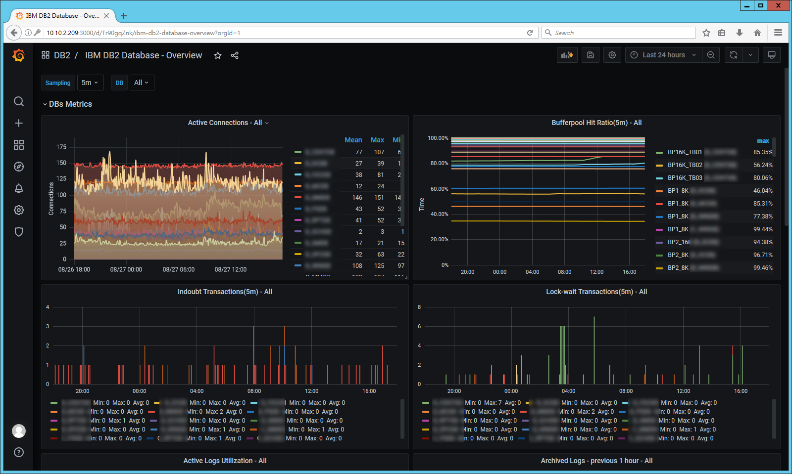
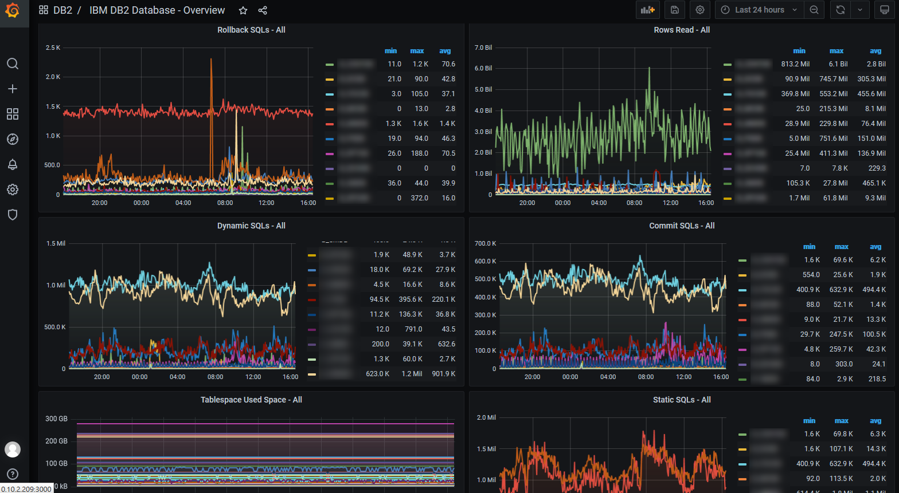
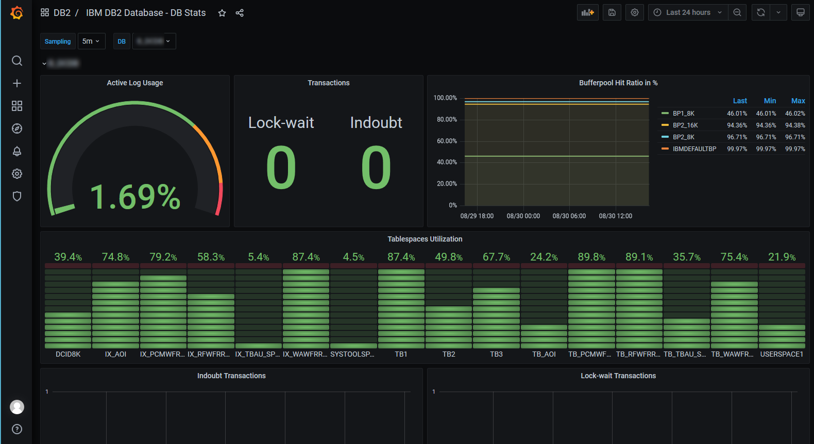
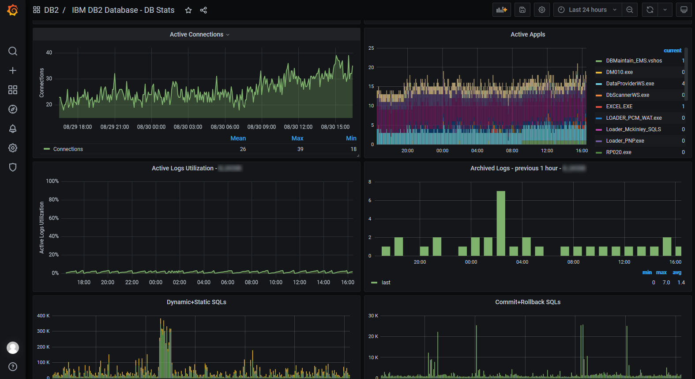

# DB2 Telegraf

DB2 Telegraf - a plugin of [Telegraf](https://www.influxdata.com/time-series-platform/telegraf/) to collect a few performance metrics for [IBM DB2 database](https://www.ibm.com/products/db2-database).

The collector will push the data into specified [InfluxDB](https://www.influxdata.com/products/influxdb/).  

Then [Grafana](https://grafana.com/) can visualize and analyze the data in dashboards.



## Prerequisite

- Telegraf
- DB2 Client v9.7+ for UNIX-Like OS

## Installation

Assuming you already have InfluxDB & Grafana running somewhere on your network.

For DB2 Client, you also need to upload bin/*.sh into the HOME directory of the user that you install DB2 client to.

For Telegraf, you have to configure your Telegraf by referring to the file `telegraf-db2.conf`.

In my cause, I have 2 Telegraf instances running the host, one is default, the other is for DB2client.

Therefore, I created 2 separated config files for Telegraf and systemd.

- /etc/telegraf/telegraf-db2.conf
- /etc/systemd/system/telegraf-db2.service

Start the Telegrafservice

```shell
systemctl start telegraf-db2
```

## More Screenshots





